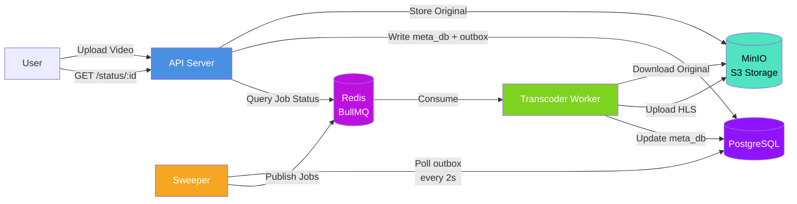

# Prototype6 Architecture

## Data Flow

### Upload Flow
1. **User** uploads video file → **API**
2. **API** computes file hash and checks for duplicates
3. **API** uploads original video to **S3** (`uploads/{hash}/original.mp4`)
4. **API** writes metadata to `meta_db` table (status: "uploaded")
5. **API** writes event to `outbox` table (status: "pending")

### Outbox Processing Flow
1. **Sweeper** polls `outbox` table every 2 seconds
2. **Sweeper** locks and fetches up to 10 pending rows (`FOR UPDATE SKIP LOCKED`)
3. **Sweeper** updates `outbox` status to "processing"
4. **Sweeper** updates `meta_db` status to "queued"
5. **Sweeper** publishes jobs to **Redis** queue
6. **Sweeper** updates `outbox` status to "sent" with job ID

### Transcoding Flow
1. **Transcoder** consumes job from **Redis** queue
2. **Transcoder** updates `meta_db` status to "processing"
3. **Transcoder** downloads original video from **S3**
4. **Transcoder** transcodes to HLS format (360p, 480p, 720p, 1080p)
5. **Transcoder** uploads HLS segments and playlists to **S3** (`videos/{jobId}/`)
6. **Transcoder** creates and uploads master playlist (`master.m3u8`)
7. **Transcoder** updates `meta_db` status to "completed"
8. **Transcoder** cleans up temporary files

### Status Query Flow
1. **User** requests status → **API**
2. **API** queries **Redis** for job state and progress
3. **API** returns job status, progress, and HLS playlist URLs

## Key Features

- **Outbox Pattern**: Ensures reliable event publishing using database transactions
- **Duplicate Detection**: File hash-based deduplication prevents re-processing
- **Multi-Resolution HLS**: Transcodes to 4 resolutions (360p, 480p, 720p, 1080p)
- **Concurrent Processing**: Sweeper uses `FOR UPDATE SKIP LOCKED` for safe concurrent access
- **Progress Tracking**: Real-time job progress updates via BullMQ
- **Monorepo Structure**: Shared packages for database, queue, and S3 client

